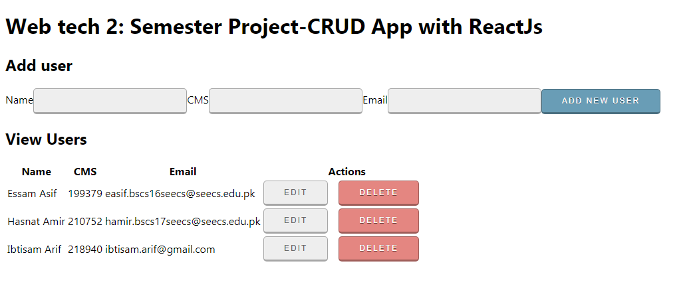

# Web Technologies 2 - Semester Project:
== Developing a React Application for Semester Project
=== Each task below has equal weightage and code from all team members is required.
* Clone this repository and after completion push your changes. (Hasnat Amir)
* All records have a edit and delete option with them. (Ibtisam Arif)
* Records should comprise of students in the group (CMS_ID, Student_Name, Email) (Hasnat Amir)
* Edit takes you to the page with all the record from database loaded in a form. (Ibtisam Arif)
* Insert new record using a separate form, this form as a. (Essam Asif)
* Update the README.md with the student names and CMS_ID listed at the end. (Essam Asif)
* Upload you group assignment as a git push. (Hasnat Amir)

## Installation:
```
npm install
```
## Demo 



## Contributor:
* Hansat Amir   -   210752  -   [github/hasnatamir2](https://github.com/hasnatamir2)
* Ibtisam Arif  -   218940  -   [github/ibtisamarif831](https://github.com/ibtisamarif831)
* Essam Asif    -   199379  -   [github/danktrees](https://github.com/danktrees)
